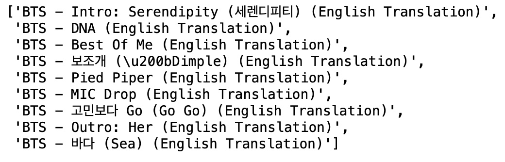

# BTS Lyrics Analysis

## Keyword Extraction
**Goal**: a method for English-speakers to learn vocabulary of a foreign language is to listen to content in that language and have a short list of keywords that you listen for

Using keyword extraction method RAKE and English-translated song lyrics, I extracted some keywords for each BTS song. A future improvement would be to do the extraction on the original Korean lyrics to ensure the correct Hangul vocabulary is used.

### Files
*GeniusLyrics_Get English Translation Lyrics.ipynb*
 - gets the English Translated lyrics of BTS songs using the Genius API
 - outputs a uncleaned dataframe of songs with lyrics and metadata

*BTS keyword extraction.ipynb*
- cleans the dataset and gets it ready for keyword extraction analysis
- RAKE method for keyword extraction
- outputs table of top English keywords per song

### Resources
**How to Get started with Genius API**: https://towardsdatascience.com/song-lyrics-genius-api-dcc2819c29

**Genius API documentation**: https://docs.genius.com/#referents-h2

**Official lyricsgenius documentation**: https://lyricsgenius.readthedocs.io/en/master/index.html
